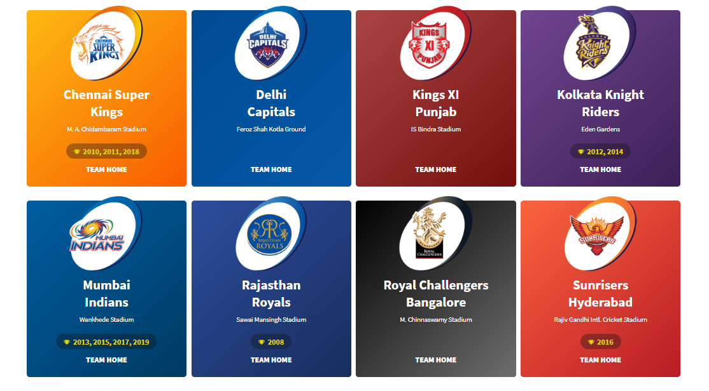

# EDA-IPL-2008-2019
Exploratory Data Analysis of IPL[2008-2019].
Lets check upon our analysis furthur. Just a note, the data available over her is from 2008-2019, and all the data findings have been as per the data.
Indian Premier League (better known as IPL) is a short format (T-20) Mens Cricket tournament that is hosted in India. It is currently presided over by the Board of Cricket Control of India (BCCI). The Tournament comprises of 8 teams who complete with each other in a league format, which is followed by a knockout Stage.

